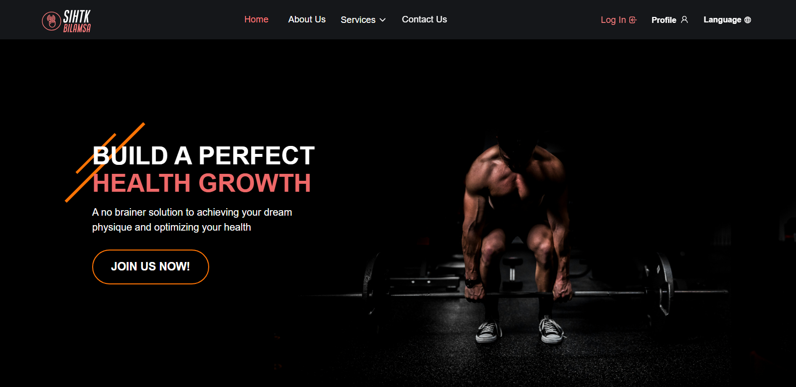
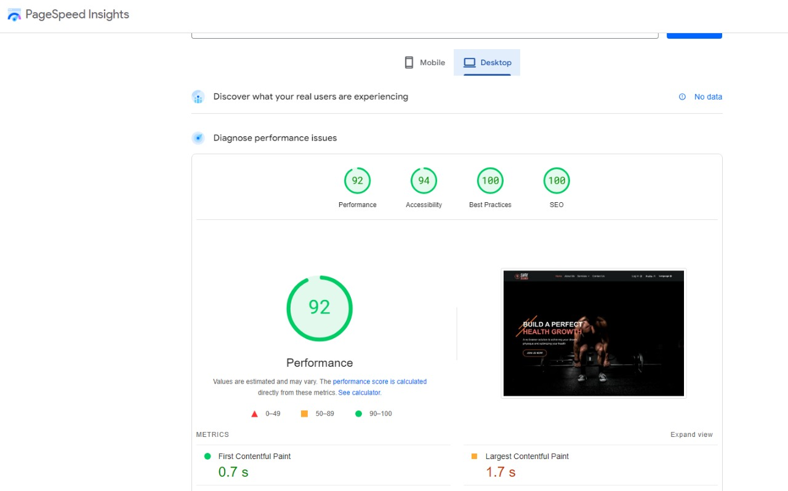

# SIHTK BLAMSA

</img>

> Sihtk Bilamsa is a platform that helps you lead a healthy lifestyle. With our tools, you can track physical activity and set goals. Our mission is to create a community of people passionate about health and enable individuals to lead a healthy lifestyle.

## Features

-   **Sports Activity Tracking:** Allows users to record and track various sports activities such as walking, running, cycling, and more.
-   **Setting Health Goals:** Users can set personal health goals and track their progress towards achieving these goals.
-   **Providing Health Tips and Resources:** Offering articles and educational resources on health and wellness to help users make better health decisions.
-   **Reminders and Scheduling:** Ability to set reminders for meals, water intake, and exercise sessions to help users adhere to a healthy routine.


## Tools and libraries used

-   react
-   typeScript
-   sass
-   antd
-   react-redux
-   @reduxjs/toolkit
-   axios
-   react-router-dom
-   react-icons
-   Firebase
-   aos
-   vite
-   million


## Performance 

 </img>


## Getting Started

1. Clone this repository.

    ```bash
    git clone https://github.com/aligamaljk/sihtkBilamsa.git
    ```

2. Navigate to the Project Directory:
    ```bash
    cd sihtkBilamsa
    ```
3. Install Dependencies:

    ```bash
     npm install
    ```

4. Start the Development Server:

    ```bash
    npm run dev
    ```

5. Open in your Browser:

    Open your web browser and go to http://localhost:5173 to see the app in action.

_Now, sihtk blamsa is up and running on your local machine._
